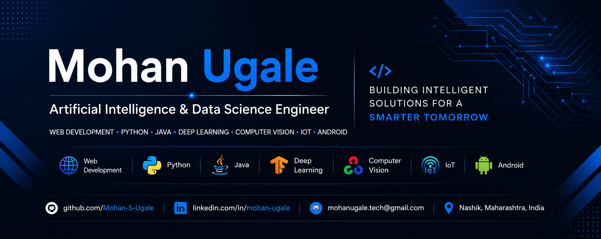

  

# Hi there 👋, I'm Mohan Ugale

## Artificial Intelligence & Data Science Engineer

I am an Artificial Intelligence & Data Science Engineer passionate about building intelligent software solutions using Machine Learning, Deep Learning, Computer Vision, IoT, and Android Development. I enjoy solving real-world problems through technology and continuously learning new tools and frameworks.

---

## 🚀 About Me

- 🎓 B.E. in Artificial Intelligence & Data Science.
- 🎓 Diploma in Computer Technology from K. K. Wagh Polytechnic, Nashik
- 💻 Passionate about Artificial Intelligence, Computer Vision, IoT, and Software Development
- 🌱 Currently learning Deep Learning, MLOps, and Computer Vision
- 🔍 Interested in AI Engineering, Machine Learning, and Software Development
- 📍 Nashik, Maharashtra, India

---

## 🛠️ Tech Stack

---

## 📌 Featured Projects

| Project | Description |
|---------|-------------|
| 🐆 **[SentinelEye](https://github.com/Mohan-S-Ugale/SentinelEye-Wild-Animal-Intrusion-Detection-System)** | AI-powered wild animal intrusion detection using Raspberry Pi, Deep Learning, OpenCV, and Flask. |
| 🌱 **[Agri Assist](https://github.com/Mohan-S-Ugale/Agri-Assist-NPK-Soil-Analysis)** | NPK-based soil analysis, crop recommendation, and fertilizer suggestion system. |
| 😊 **[Human Emotion Detection](https://github.com/Mohan-S-Ugale/Human-Emotion-Detection-System)** | Real-time emotion recognition using Deep Learning, CNN, OpenCV, and Flask. |
| 🔥 **[IoT Gas Leakage Detection](https://github.com/Mohan-S-Ugale/IoT-Gas-Leakage-Detection-System)** | Arduino-based gas leakage monitoring and alert system. |
| 📱 **[Android Mobile Sensor Tester](https://github.com/Mohan-S-Ugale/Android-Mobile-Sensor-Tester)** | Android app for testing smartphone sensors, camera, and flashlight. |
| 🛒 **[Grocery Billing System](https://github.com/Mohan-S-Ugale/Grocery-Billing-System-using-Python)** | Python Tkinter desktop application for grocery billing. |

---

## 🏆 Achievements

🥇 First Runner-up – UpXGen Hackathon 2023

🥈 Second Winner – Institute-Level Smart India Hackathon (SIH) 2026

---

## 📫 Connect with Me

- 📧 Email: **mohanugale.tech@gmail.com**
- 💼 LinkedIn: **https://linkedin.com/in/mohan-ugale**

---

⭐ Thanks for visiting my profile!
